# Heart Disease & Heart Attack Prediction Using Machine Learning  
A multi-dataset machine learning project predicting **Heart Disease** (clinical indicators) and **Heart Attack** outcomes (biomarkers + vitals).  

This project demonstrates a complete end-to-end ML workflow including data preparation, modeling, evaluation, explainability (SHAP), and interpretation aligned with real clinical knowledge.

---

# Table of Contents
- [Key Insights & Findings](#key-insights--findings)
  - [Clinical Heart Disease Model](#clinical-heart-disease-model)
  - [Biomarker Heart Attack Model](#biomarker-heart-attack-model)

- [Project Summary](#project-summary)

- [Datasets Used](#datasets-used)
  - [Heart Disease Dataset (Clinical Features)](#heart-disease-dataset-clinical-features)
  - [Heart Attack Dataset (Biomarkers)](#heart-attack-dataset-biomarkers)

- [Heart Disease Model — Clinical Features](#heart-disease-model--clinical-features)
  - [EDA](#eda)
  - [Modeling](#modeling)
  - [Model Evaluation](#model-evaluation)
  - [Feature Importance & SHAP](#feature-importance--shap)

- [Heart Attack Model — Biomarkers](#heart-attack-model--biomarkers)
  - [EDA](#eda-1)
  - [Modeling](#modeling-1)
  - [Model Evaluation](#model-evaluation-1)
  - [Feature Importance & SHAP](#feature-importance--shap-1)

- [Conclusions](#conclusions)

- [How to Run Locally](#how-to-run-locally)

- [Tech Stack](#tech-stack)

- [License](#license)

---

# Key Insights & Findings  

## Clinical Heart Disease Model  

The clinical heart disease dataset centers on long-term cardiac risk using ECG features, blood pressure, cholesterol, and exercise-induced indicators.

- **ST_Slope (up)** strongly predicted *no* heart disease.  
- **Exercise-induced angina** was a major positive risk indicator.  
- **Fasting blood sugar (FastingBS)** contributed to classification.  

Patients with:
- **Higher MaxHR**,  
- **Lower Oldpeak**, and  
- **Absence of angina**  

were more likely to be classified as *not* having heart disease.

Patients with:
- **Low ST_Slope**,  
- **Exercise angina**,  
- **High cholesterol**  

were more likely to be classified as having heart disease.

These patterns closely match established cardiology understanding.

---

## Biomarker Heart Attack Model  

This model predicts **acute myocardial events** using blood biomarkers and vitals.

XGBoost achieved near-perfect performance:

| Metric | Score |
|--------|--------|
| **Accuracy** | 98.5% |
| **Sensitivity** | 98.8% |
| **Specificity** | 98.7% |
| **F1 Score** | 98.8% |

Key insights:
- **Troponin** was the strongest predictor of heart attack.
- **CK-MB** was the second most influential biomarker.
- **Low biomarker levels** pushed predictions toward *no* heart attack.
- Age, gender, and blood pressure played smaller roles.

These findings reflect real emergency cardiology diagnostics.

---

# Project Summary  

Two different cardiac problems were modeled:

### **1. Chronic heart disease classification**  
(using ECG, cholesterol, blood pressure, exercise responses)

### **2. Acute heart attack outcome prediction**  
(using Troponin, CK-MB, vitals, and blood chemistry)

Both models were evaluated using:
- Logistic Regression  
- Random Forest  
- XGBoost  
- Stacked ensembles (heart disease only)

Explainability was performed using **feature importance** and **SHAP** plots.

---

# Datasets Used

## Heart Disease Dataset (Clinical Features)
**File:** `heart.csv`  
**Columns:**
```
Age, Sex, ChestPainType, RestingBP, Cholesterol, 
FastingBS, RestingECG, MaxHR, ExerciseAngina, 
Oldpeak, ST_Slope, HeartDisease
```

---

## Heart Attack Dataset (Biomarkers)
**File:** `Medicaldataset.csv`  
**Columns:**
```
Age, Gender, Heart rate, Systolic blood pressure, 
Diastolic blood pressure, Blood sugar, CK-MB, Troponin, Result
```

---

# Heart Disease Model — Clinical Features

## EDA  
Exploratory Data Analysis revealed:

- **ST_Slope, Oldpeak, ChestPainType, and ExerciseAngina** showed strong separation between positive and negative cases.
- Exercise-related ECG features were highly correlated with the presence of heart disease.

Visualization:  
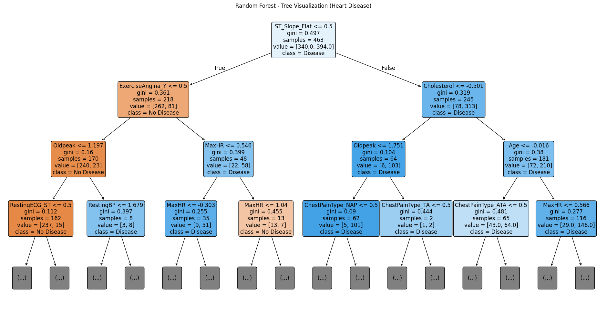

---

## Modeling  
Models trained:
- **Logistic Regression**  
- **Random Forest**  
- **XGBoost**  
- **Stacked Ensemble** (LR + RF + XGBoost)

---

## Model Evaluation  

### Logistic Regression (Heart Disease)

| Metric | Score |
|--------|--------|
| **Accuracy** | 83.2% |
| **Sensitivity** | 84.1% |
| **Specificity** | 87.0% |

Correct classifications:  
- **90 True Positives**  
- **67 True Negatives**  
- **17 False Negatives**  
- **10 False Positives**

Confusion Matrix:  
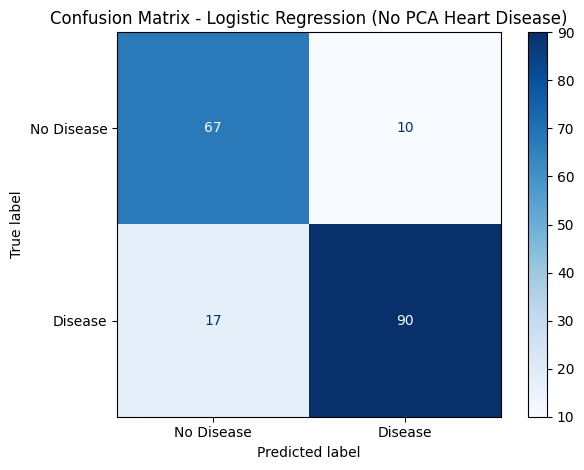

---

### Random Forest (Heart Disease)

| Metric | Score |
|--------|--------|
| **Accuracy** | 87.5% |
| **Sensitivity** | 88.8% |
| **Specificity** | 85.7% |
| **F1 Score** | 89.2% |

Decision Tree Example:  


---

### XGBoost (Heart Disease)

| Metric | Score |
|--------|--------|
| **Accuracy** | 87% |
| **Sensitivity** | 88% |
| **Specificity** | 85.7% |
| **F1 Score** | 89% |

Feature Importance:  
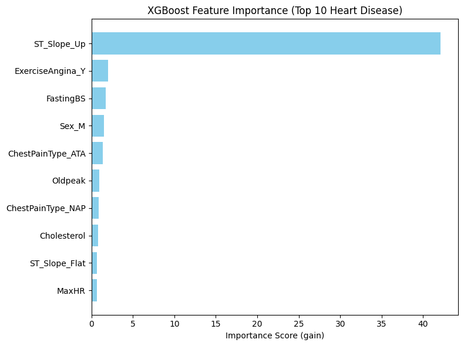

---

### Stacked Ensemble (Heart Disease)

| Metric | Score |
|--------|--------|
| **Accuracy** | 87% |
| **Sensitivity** | 88% |
| **Specificity** | 85.7% |
| **F1 Score** | 89% |

Confusion Matrix:  
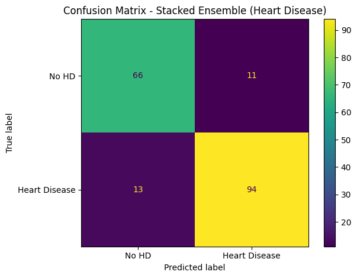

No meaningful improvement over XGBoost or Random Forest, but ensemble remained stable.

---

## Feature Importance & SHAP  

### SHAP Summary (Heart Disease)  
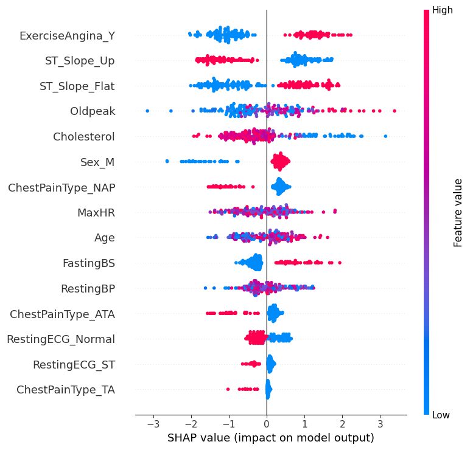

**Top Contributors:**
- **ST_Slope (up)** → strongest indicator of *no* heart disease  
- **ExerciseAngina_Y** → large positive push toward heart disease  
- **Oldpeak** → higher values increased heart disease probability  
- **MaxHR** → higher values pushed predictions toward healthy  

### SHAP Waterfall (Heart Disease)  
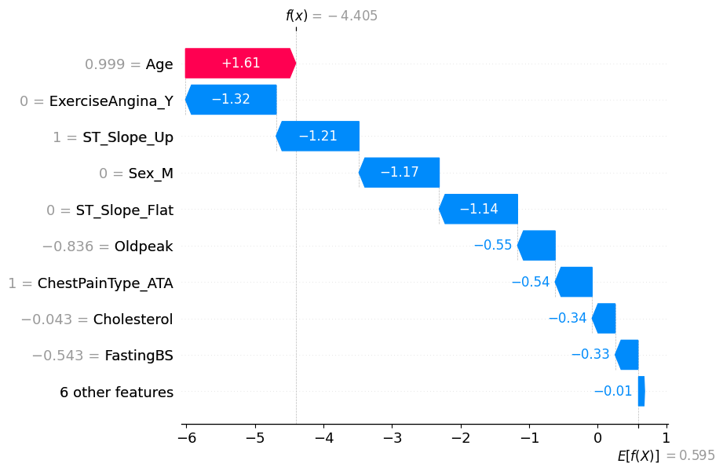

Shows the cumulative impact of each feature on an individual prediction.

---

# Heart Attack Model — Biomarkers  

## EDA  
The biomarkers dataset showed extremely strong class separation:

- Troponin and CK-MB values were dramatically higher in positive cases.
- Blood pressure and blood sugar contributed secondary effects.

Feature Exploration (Heart Attack):  
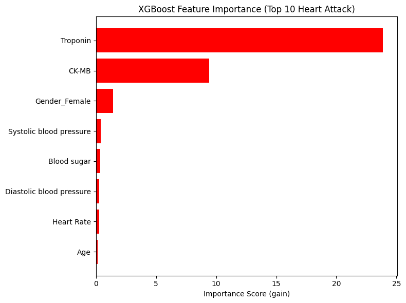

---

## Modeling

Trained models:
- **Logistic Regression**
- **Random Forest**
- **XGBoost** (best performing)

---

## Model Evaluation  

### Logistic Regression (Heart Attack)

| Metric | Score |
|--------|--------|
| **Accuracy** | 79.9% |
| **Sensitivity** | 85.2% |
| **Specificity** | 71.6% |

Confusion Matrix:  
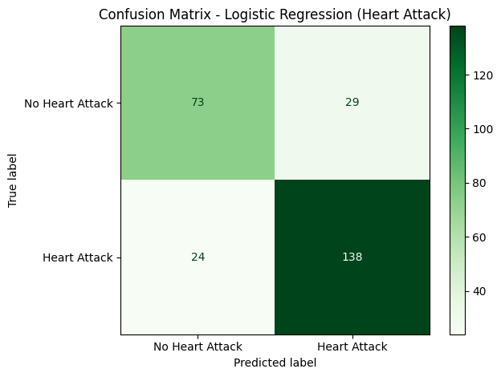

---

### Random Forest (Heart Attack)

| Metric | Score |
|--------|--------|
| **Accuracy** | 98.5% |
| **Sensitivity** | 98.8% |
| **Specificity** | 98% |
| **F1 Score** | 98.4% |

Feature Importance (RF Heart Attack):  
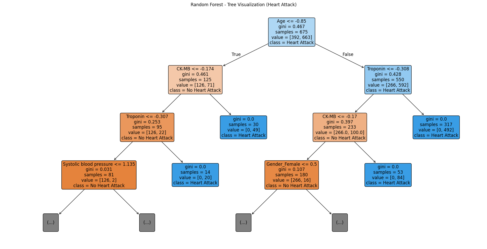

---

### XGBoost (Heart Attack)

| Metric | Score |
|--------|--------|
| **Accuracy** | 98.5% |
| **Sensitivity** | 98.8% |
| **Specificity** | 98.7% |
| **F1 Score** | 98.8% |

Identical performance to Random Forest — near-perfect classification.

---

## Feature Importance & SHAP  

### SHAP Summary (Heart Attack)
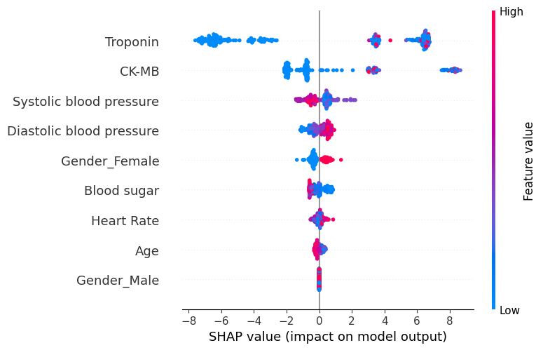

- **Troponin** → strongest positive driver  
- **CK-MB** → second dominant biomarker  
- **Blood sugar**, **blood pressure**, **age** show smaller contributions  

### SHAP Waterfall (Heart Attack)
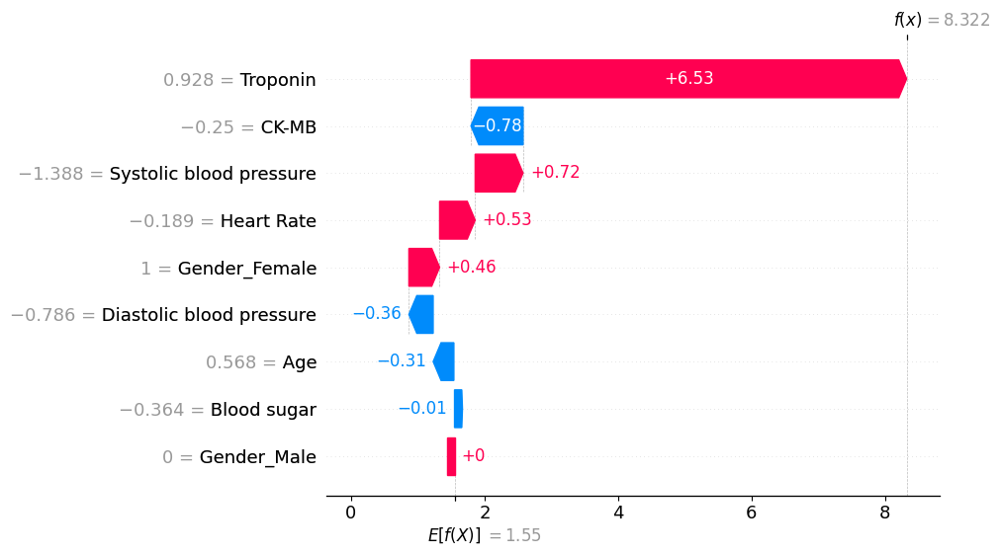

Shows how biomarkers push model predictions toward “Heart Attack” vs “No Heart Attack.”

---

# Conclusions  

- Two distinct cardiac prediction tasks were successfully modeled:  
  - **Chronic heart disease** using clinical and ECG features  
  - **Acute heart attack** using biomarkers and vital signs  

- Random Forest and XGBoost consistently provided the best performance across datasets.

- SHAP and feature importance revealed medically meaningful predictors:
  - **ST_Slope, ExerciseAngina, Oldpeak, MaxHR** for heart disease  
  - **Troponin, CK-MB** for heart attack  

- Ensembles did not outperform tree-based models, indicating strong baseline separability in both datasets.

- The biomarkers dataset demonstrated **extreme predictive power**, closely matching real-world diagnostic expectations.

---

# How to Run Locally  

```bash
git clone https://github.com/GaryJS/Heart_Disease_ML.git
pip install numpy pandas matplotlib seaborn scikit-learn
jupyter notebook data_practicum.ipynb
```

---

# Tech Stack  
- Python  
- NumPy / Pandas  
- Scikit-Learn  
- XGBoost  
- Matplotlib / Seaborn  
- SHAP  
- Jupyter Notebook  

---

# License  
This project is available for educational and portfolio use.

